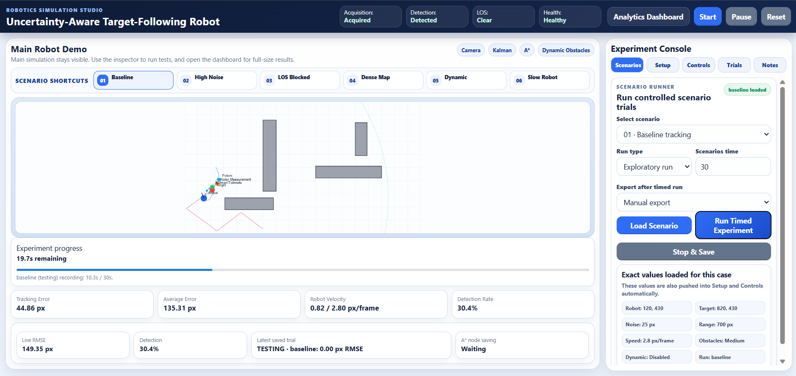
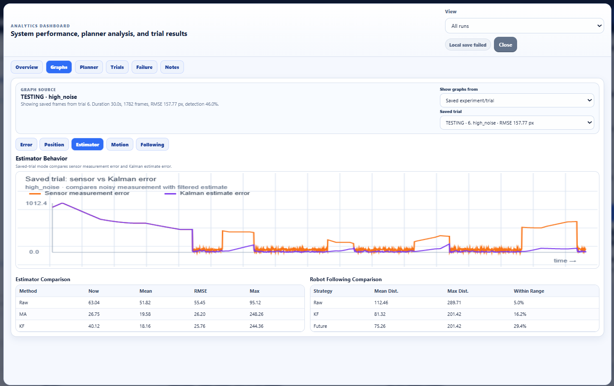
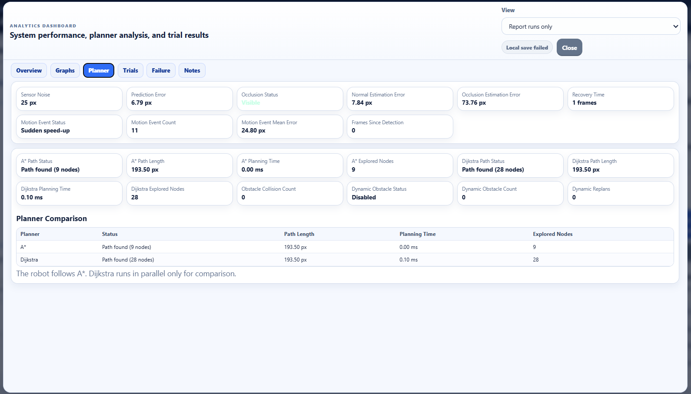
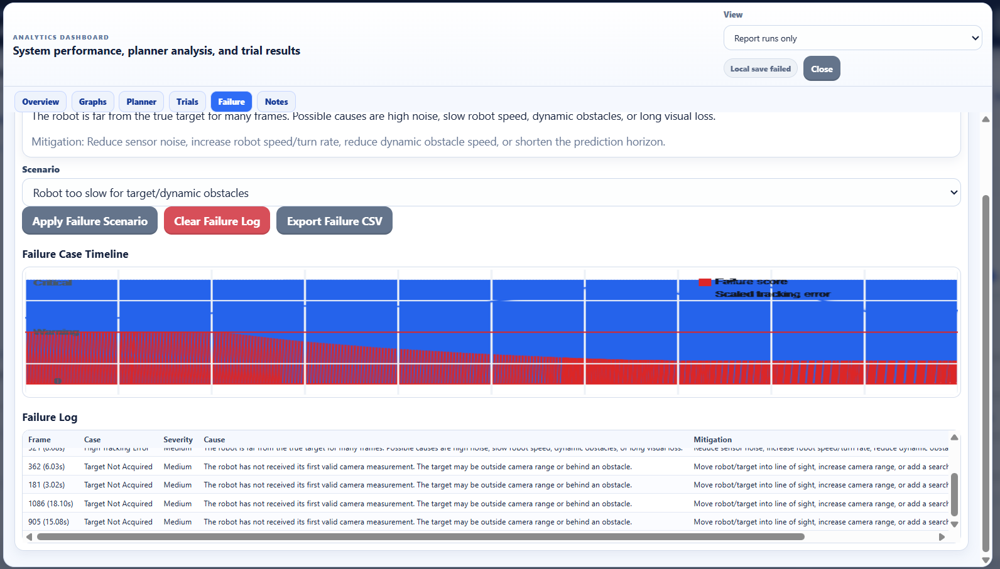

# Uncertainty-Aware Autonomous Target-Following Robot

A browser-based robotics simulation for autonomous target following under sensing uncertainty, obstacle constraints, and dynamic environment changes.

The system models a mobile robot that follows a moving target using noisy camera-like measurements. A 4-state Kalman filter estimates the target state, A* plans a collision-aware route around obstacles, and Dijkstra is used as a baseline planner comparison. The simulation also includes line-of-sight blocking, dynamic obstacles, controlled experiment logging, and failure-case analysis.

---

## Project Overview

Target following is a common robotics problem in assistive robots, warehouse robots, hospital support robots, luggage-following robots, and indoor mobile robots. In practical settings, a robot cannot assume perfect target location. Sensor measurements may be noisy, the target may temporarily disappear, obstacles may block visibility, and the robot may face motion limits.

This project simulates those challenges in a 2D environment and evaluates how estimation, planning, and control work together in a target-following pipeline.

---

## Core Robotics Pipeline

```text
Moving Target
    ↓
Camera-like Sensor Model
    ↓
Visibility, Range, and Line-of-Sight Check
    ↓
Noisy Target Measurement
    ↓
Target Acquisition
    ↓
4-State Kalman Filter [x, y, vx, vy]
    ↓
A* Path Planning Around Obstacles
    ↓
Robot Motion Controller
    ↓
Experiment Metrics and Failure Analysis
```

The simulator knows the ground-truth target position for evaluation, but the robot does not directly use the true position. The robot acts on noisy measurements and filtered estimates.

---

## Key Features

### 1. Camera-Like Sensing

- Configurable sensor noise.
- Camera range limitation.
- Target acquisition logic.
- Temporary target loss.
- Line-of-sight blocking by obstacles.
- Prediction-only behavior when the target is not visible.

### 2. Kalman-Based State Estimation

The estimator tracks the target using a 4-state model:

```text
State = [x, y, vx, vy]
```

The Kalman filter predicts target motion and corrects the estimate whenever a new camera-like measurement is available.

### 3. Obstacle-Aware Path Planning

- Static obstacle maps.
- A* path planning for robot navigation.
- Dijkstra planner used as a comparison baseline.
- Path length, planning time, and explored-node metrics.
- Dynamic replanning when the environment changes.

### 4. Realistic Robot Motion

- Maximum velocity limit.
- Acceleration limit.
- Turning-rate limit.
- Safe following distance.
- Collision monitoring.

### 5. Dynamic Obstacles

The environment can include moving obstacles that force the robot to replan during target following.

### 6. Failure-Case Analysis

The system identifies and reports difficult operating conditions such as:

- target not acquired,
- target outside camera range,
- line-of-sight blocked,
- no valid path,
- robot stuck near obstacles,
- high tracking error,
- slow robot response.

---
## Preliminary Experimental Results from Saved Testing Trials

The simulation was evaluated using saved browser-based testing trials covering baseline target following, high sensor noise, line-of-sight blocking, dense obstacle planning, and dynamic obstacle replanning.

> These results are from saved testing trials generated through the browser-based experiment dashboard. They are used to demonstrate system behavior across different sensing, planning, and control conditions.

### Key Findings

In the saved test trials, the baseline run achieved **160.80 px tracking RMSE** with a **26.7% detection rate** and **0 collisions**.

Under high sensor noise, tracking RMSE became **157.77 px**, which was **1.9% lower than the selected baseline run**. This indicates that the Kalman-based estimation pipeline remained stable under increased measurement noise.

In the line-of-sight blocked case, the blocked rate reached **100.0%**, confirming that the simulated camera model does not unrealistically detect a target through obstacles.

In dense obstacle conditions, A* explored **16.6 nodes** compared with Dijkstra’s **38.6 nodes**, giving a **57.1% node reduction**. This shows that A* was more search-efficient than Dijkstra while solving the planning problem.

With dynamic obstacles enabled, the planner triggered **401 replans** while recording **0 collisions**, demonstrating dynamic replanning behavior in a changing environment.

---

### Saved Trial Summary

| Run Type | Scenario | Tracking RMSE | Detection Rate | LOS Blocked Rate | A* Nodes | Dijkstra Nodes | A* Node Reduction | Dynamic Replans | Collisions |
|---|---|---:|---:|---:|---:|---:|---:|---:|---:|
| TESTING | baseline | 160.80 px | 26.7% | 72.7% | 3.4 | 23.8 | 85.7% | 0 | 0 |
| TESTING | baseline | 322.50 px | 55.3% | 24.5% | 34.3 | 127.7 | 73.1% | 0 | 0 |
| TESTING | baseline | 131.04 px | 31.7% | 62.1% | 3.6 | 22.4 | 84.1% | 0 | 0 |
| TESTING | baseline | 0.00 px | 0.0% | 100.0% | 0.0 | 0.0 | -- | 0 | 0 |
| TESTING | baseline | 162.18 px | 60.2% | 23.8% | 10.7 | 46.7 | 77.0% | 0 | 0 |
| TESTING | high_noise | 157.77 px | 46.0% | 33.5% | 10.1 | 57.4 | 82.4% | 0 | 0 |
| TESTING | line_of_sight_blocked | 0.00 px | 0.0% | 100.0% | 0.0 | 0.0 | -- | 0 | 0 |
| TESTING | line_of_sight_blocked | 0.00 px | 0.0% | 100.0% | 0.0 | 0.0 | -- | 0 | 0 |
| TESTING | line_of_sight_blocked | 297.22 px | 40.9% | 40.8% | 15.7 | 76.0 | 79.4% | 0 | 0 |
| TESTING | line_of_sight_blocked | 332.09 px | 29.5% | 59.5% | 18.5 | 69.8 | 73.5% | 0 | 0 |
| TESTING | dense_obstacles | 119.12 px | 56.4% | 22.0% | 16.6 | 38.6 | 57.1% | 0 | 0 |
| TESTING | dynamic_obstacles | 475.28 px | 1.4% | 94.5% | 57.5 | 131.9 | 56.4% | 401 | 0 |

---
---

## System Demonstration

### Baseline Target Following



The baseline simulation shows the target-following pipeline with the moving target, robot, Kalman estimate, obstacle-aware A* path, and live performance metrics.

### Kalman Estimation Under High Sensor Noise



The high-noise scenario demonstrates how the Kalman filter smooths noisy camera-like measurements and provides a more stable target estimate.

### A* and Dijkstra Planner Comparison



The dense obstacle scenario compares A* and Dijkstra planning behavior using explored nodes, planning time, and path metrics.

### Failure-Case Analysis



The failure dashboard records system limitations such as poor visibility, tracking loss, high error, and robot motion constraints.

---

### Interpretation

The saved trials show that the system can run target-following experiments under multiple sensing and planning conditions. The line-of-sight blocked cases confirm that the camera model respects obstacle-based visibility constraints. The dense obstacle scenario shows that A* explores fewer nodes than Dijkstra, supporting its use as the main planner. The dynamic obstacle scenario demonstrates that the system can trigger repeated replanning while avoiding collisions.

The high variation in tracking RMSE across baseline and line-of-sight blocked trials shows that target visibility, obstacle placement, and acquisition timing strongly affect tracking performance. This is expected in an uncertainty-aware simulation where the robot depends on noisy and partially observable measurements rather than direct ground-truth target access.

---

## Scenario Library

The interface includes predefined scenarios for repeatable evaluation.

| Scenario | Purpose |
|---|---|
| `baseline` | Normal reference run for target following |
| `high_noise` | Evaluates Kalman robustness under high sensor noise |
| `line_of_sight_blocked` | Tests camera visibility when an obstacle blocks the target |
| `dense_obstacles` | Evaluates planner behavior in a cluttered map |
| `dynamic_obstacles` | Tests replanning when obstacles move |
| `slow_robot` | Demonstrates tracking limitations when the robot is slower than required |

Each scenario automatically configures the robot position, target position, sensor noise, camera range, obstacle density, dynamic obstacle state, and trial name.

---

## Metrics Logged

The experiment system records both summary-level and frame-level metrics.

### Target Tracking Metrics

- Tracking error
- Mean tracking error
- Tracking RMSE
- Detection rate
- Line-of-sight blocked rate
- Frames since last detection

### Estimation Metrics

- Raw measurement error
- Moving average error
- Kalman filter error
- Estimator RMSE comparison
- Prediction error during target loss

### Planning Metrics

- A* path status
- A* path length
- A* planning time
- A* explored nodes
- Dijkstra path status
- Dijkstra path length
- Dijkstra planning time
- Dijkstra explored nodes
- A* node-saving percentage compared with Dijkstra

### Control and Failure Metrics

- Robot speed
- Dynamic replan count
- Collision count
- Failure severity
- Failure cause
- Suggested mitigation

---

## Analytics Dashboard

The project includes an analytics dashboard for reviewing system performance.

Dashboard sections include:

- live performance snapshot,
- estimator comparison graphs,
- target and robot position graphs,
- A* and Dijkstra planner comparison,
- saved trial table,
- experiment summary graph,
- failure timeline,
- report-ready findings generated from measured trial data.

Saved trial summaries are stored in browser `localStorage`, and experiment data can be exported as CSV.

---

## Exported Data

The application can export:

```text
results/experiment-summary.csv
results/frame-log.csv
```

The repository includes a template file:

```text
results/experiment-summary-template.csv
```

Measured CSV files should be generated from actual simulation runs.

---

## How to Run

Open the project folder and start a local server:

```bash
python -m http.server 8000
```

Then open:

```text
http://localhost:8000
```

The simulation is implemented using HTML, CSS, JavaScript, and the Canvas API. No external JavaScript libraries are required.

---

## Repository Structure

```text
.
├── index.html
├── style.css
├── script.js
├── README.md
├── LICENSE
├── RUN_INSTRUCTIONS.txt
├── docs/
│   ├── demo-script.md
│   ├── interview-qa.md
│   ├── portfolio-text.md
│   ├── project-notes.md
│   └── robotics_project_quantitative_test_plan.xlsx
├── results/
│   └── experiment-summary-template.csv
└── assets/
    └── screenshots/
```

---

## Tech Stack

- HTML
- CSS
- JavaScript
- Canvas API

---

## Limitations

- The system is a 2D browser-based simulation, not a deployed physical robot.
- The camera is represented as a simulated sensing model.
- Obstacles are simplified geometric objects.
- Dynamic obstacles follow simulated motion rules.
- The project does not currently include ROS, SLAM, real motors, or hardware deployment.

---

## Future Work

- Real camera/OpenCV validation.
- ROS 2, Gazebo, or Webots implementation.
- SLAM-based map generation.
- Multi-target tracking.
- Crowd-aware navigation.
- Local dynamic-window planning.
- Hardware deployment on a mobile robot platform.

---

## Project Summary

This project demonstrates an integrated robotics pipeline for target following under uncertainty. It combines perception modeling, Kalman state estimation, obstacle-aware path planning, planner comparison, dynamic replanning, robot motion constraints, quantitative experiment logging, and failure analysis in a browser-based simulation.

